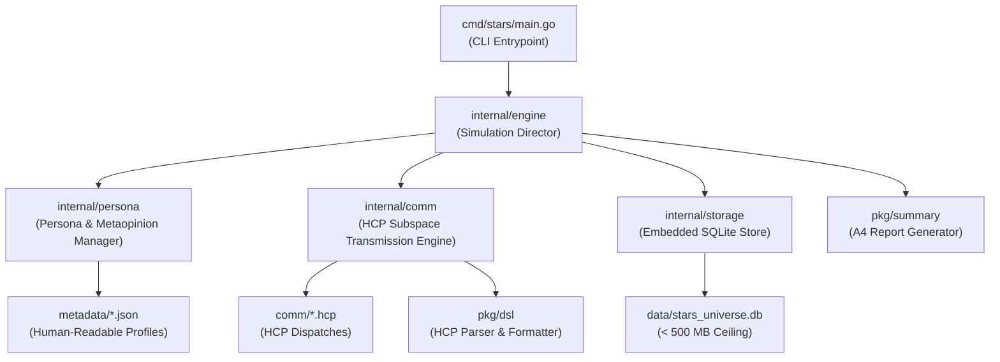
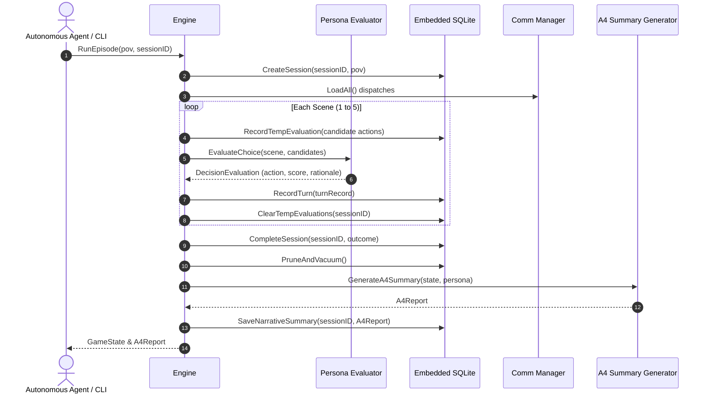

# Architecture: The Stars, Like Dust Simulation Engine

This document details the architectural design, subsystems, data flow, and runtime guarantees of the autonomous Go simulation engine based on Isaac Asimov's *The Stars, Like Dust*.

---

## 1. High-Level System Architecture

The simulation engine is built in idiomatic pure Go (Go 1.26), utilizing modular decoupling across engine orchestration, persona evaluation, domain-specific communication, and embedded persistence.

---

## 2. Core Subsystems

### 2.1 Persona & Metaopinion Engine (`internal/persona`)
The persona subsystem loads character profiles from `metadata/` and models:
1. **Canonical Traits**: Physical characteristics, background, and canon behavioral tendencies.
2. **Psychological Drivers**:
   - `PrimaryGoal`: The overarching objective guiding decision evaluation.
   - `Vulnerability`: Emotional blindspots that affect decision risks.
   - `GrowthArc`: Character development trajectory over the episode.
3. **Exploratory Metaopinions**:
   - Explicit philosophical stances not covered in the original novel (e.g. Asimovian imperial lifecycle, constitutionalism vs feudalism).
   - Associated with a `CertaintyScore` (0.0 to 1.0) and `NarrativeWeight` (`critical`, `high`, `pivotal`).
4. **Action Evaluation (`evaluator.go`)**:
   - Scores candidate actions against the active character's primary goal, psychological traits, and metaopinions.
   - Generates tactical rationale explaining why the character chose that action.

### 2.2 Simulation Engine & Multi-POV Director (`internal/engine`)
The engine governs episodic execution:
- **Multi-POV Support**: Supports starting a run from any of the 6 major novel characters (`biron_farrill`, `artemisia_hinriad`, `simok_aratap`, `gillbret_hinriad`, `sander_jonti`, `hinrik_hinriad`).
- **Autonomous Play**: Runs completely without human prompt loops. When an actor takes a turn:
  - If the actor is the selected POV: chooses the optimal action based on persona evaluation.
  - If the actor is non-POV: operates in auto-mode using that character's individual persona drivers.
- **Bounded Episodic Turns**: Hard limit of 5 scenes per episode, eliminating infinite loops and conserving execution resources.

### 2.3 Hyper-Comm Protocol (HCP) Subsystem (`pkg/dsl` & `internal/comm`)
An invented subspace communication Domain Specific Language:
- **Syntax**: Structured headers (`DISPATCH`, `ENCRYPTION`, `ORIGIN`, `TARGET`, `STARDATE`, `PRIORITY`, `STATUS`), indented payload tuples (`EVENT`, `INTEL`, `DIRECTIVE`, `QUERY`, `COMPACT`, `STATEMENT`), and `AUTHENTICATION`.
- **Parser (`pkg/dsl/parser.go`)**: Full line scanner, AST generator, and strict validator.
- **Formatter (`pkg/dsl/formatter.go`)**: Round-trip AST serializer for dispatch generation.
- **Manager (`internal/comm/manager.go`)**: Directory loader, target filtering, and disk persistence.

### 2.4 Embedded Storage & Capacity Control (`internal/storage`)
- **Engine**: Pure-Go SQLite (`modernc.org/sqlite`) with zero CGO dependencies.
- **Database File**: `data/stars_universe.db`.
- **Strict Size Ceiling**: Hard check enforcing `< 500 MB` (active file size is ~60 KB).
- **Temporary Tables**:
  - `temp_decision_evaluations`: Used during each scene to log candidate branch scores, then pruned immediately upon scene resolution.
- **Permanent Tables**:
  - `characters`: Character registry and allegiance.
  - `metaopinions`: Exploratory stances and narrative weights.
  - `game_sessions`: Session metadata, outcome summaries, and timestamps.
  - `session_turns`: Turn-by-turn logs, chosen actions, dialogue, and outcomes.
  - `narrative_summaries`: Complete A4 markdown summaries, thoughts, and queries.
- **Compaction**: Uses WAL journal mode, explicit foreign keys, and `PRAGMA vacuum` to prevent database bloat.

### 2.5 Narrative Deliverable Generator (`pkg/summary`)
Formats each completed session into a structured 1-to-2 page A4 report:
- **Header**: Session ID, Character POV, Stardate, Narrative Arc.
- **Section I**: Psychological Profile & Narrative Vantage.
- **Section II**: Chronological Scene Trajectory & Turn Breakdown.
- **Section III**: Exploratory Metaopinions Manifested.
- **Section IV**: Strategic & Interstellar Resolution.
- **Section V**: Reflective Thoughts for Arthur Gray.
- **Section VI**: Queries & Inquiries for the User.

### 2.6 Multi-Agent Sub-Agent Delegation (`internal/engine/subagents.go`)
Provides autonomous secondary cast modeling:
- **Role & Model Allocation**: Maps non-POV actors to autonomous sub-agents with archetypal or randomized LLM tiers (`flash_lite`, `flash`, `pro`) and cognitive effort profiles (`fast`, `medium`, `high`).
- **Dynamic HCP Standoffs**: Formats protagonist actions into outbound `.hcp` dispatches, computes recipient sub-agent reactions matching persona drivers, and generates counter-dispatches in `comm/`.
- **Token & Loop Protection**: Enforces strict 1-round ping-pong exchanges with zero recursive loops.

---

## 3. Data Flow

---

## 4. Resource & Security Guarantees
- **No Infinite Loops**: Episodic bounds ensure runs finish deterministically in 5 scenes.
- **Zero Memory Leaks**: DB handles closed cleanly with WAL checkpoints.
- **Pre-Authorized Execution**: Project binaries registered in `settings.json` to prevent interactive permission blocking.
