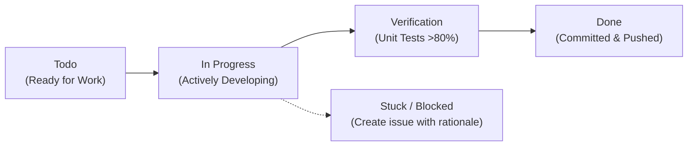

# Development & Simulation Workflow: The Stars, Like Dust

This document outlines standard developer and autonomous agent workflows for running simulations, adding content, updating Plane work items, and deploying changes.

---

## 1. Plane Issue Tracking & Sync Lifecycle

All development and simulation phases are synchronized with Plane project `STARLIKDST` (`c8dbc822-2741-402b-b50b-629a0fbc8139`).



### Transition Checklist
1. **Starting Work**: Transition work item state to `In Progress` in Plane.
2. **Development**: Implement features or tests adhering to Go 1.26 standards.
3. **Verification**: Run `make test-coverage`, `make vet`, `make fmt`.
4. **Completion**:
   - Update work item state to `Done`.
   - Post completion comment with test coverage and verification details.
   - Commit changes referencing the work item ID.
5. **Handling Blockers**: If stuck or facing an external constraint, immediately create a new work item with priority `urgent` detailing the blocker rationale, technical cause, and proposed remediation.

---

## 2. Running Autonomous Simulations

The simulation engine is designed for zero-human-input autonomous play.

### Step 1: List Character Perspectives
```bash
./stars --list-povs
```

### Step 2: Run an Episode from Any Vantage
```bash
# Run from Biron Farrill's perspective (Widemos rebellion arc)
./stars --pov biron_farrill

# Run from Lady Artemisia's perspective (Rhodian covert defiance)
./stars --pov artemisia_hinriad

# Run from Commissioner Simok Aratap's perspective (Imperial counter-insurgency)
./stars --pov simok_aratap

# Run from Director Hinrik Hinriad's perspective (The mask of folly)
./stars --pov hinrik_hinriad

# Run from Cousin Gillbret Hinriad's perspective (The visisonor & the nebula)
./stars --pov gillbret_hinriad

# Run from Autarch Sander Jonti's perspective (The Linganian gambit)
./stars --pov sander_jonti
```

### Step 3: Extract Deliverable (Summary-Only)
```bash
./stars --pov biron_farrill --summary-only
```

---

## 3. Extending Personas & Metaopinions

To introduce a new character or expand existing psychological metaopinions:

1. **Create or Modify JSON in `metadata/`**:
   ```json
   {
     "id": "new_character",
     "name": "Full Name",
     "title": "Title / Position",
     "allegiance": "Faction",
     "home_world": "World Name",
     "canonical_traits": ["Trait 1", "Trait 2"],
     "psychological_drivers": {
       "primary_goal": "Main objective",
       "vulnerability": "Weakness or blindspot",
       "growth_arc": "Development trajectory"
     },
     "metaopinions": [
       {
         "topic": "Philosophical Topic",
         "canonical_stance": "What the novel depicted",
         "exploratory_metaopinion": "Novel exploration and deeper motive",
         "certainty_score": 0.90,
         "narrative_weight": "high"
       }
     ]
   }
   ```
2. **Add Scenes in `internal/engine/scenes.go`**:
   Define the 5 dramatic scenes and candidate choices for the character.
3. **Synchronize & Test**:
   The engine automatically reads updated metadata on subsequent runs and upserts character and metaopinion records into `data/stars_universe.db`.

---

## 4. Authoring Subspace Dispatches (`comm/`)

New interstellar communications use the Hyper-Comm Protocol (HCP):

1. **Create `comm/dispatch_<num>_<slug>.hcp`**:
   ```hcp
   DISPATCH HCP-820-006
   ENCRYPTION: TYRANN-CIPHER-7
   ORIGIN: Rhodia-Directorate
   TARGET: Galactic-Subspace-Broadcast
   STARDATE: 820-G.E.330
   PRIORITY: URGENT
   PAYLOAD:
     EVENT: "Constitutional Assembly summoned on Rhodia."
     DIRECTIVE: "Fifty Star Kingdoms invited to ratify the Articles of Free Federation."
   AUTHENTICATION: SIG-HINRIAD-COUNCIL-88
   END_DISPATCH
   ```
2. **Validate**:
   Run `go test -v ./pkg/dsl/... ./internal/comm/...` to verify syntax and parsing.

---

## 5. Verification & Build Suite

Execute the standard validation pipeline before any git commit:

```bash
# Format code
make fmt

# Run static analysis
make vet

# Execute test suite with coverage report
make test-coverage

# Build the executable
make build
```

---

## 6. Git Safety Rules
- Remote uses SSH alias `github-golang` (`git@github-golang:arthurgray2k/The_Stars_Like_Dust.git`).
- Never use `git add .` — always stage relevant files explicitly.
- Never rewrite history (`push --force`, `rebase`).
- Autonomous commits and pushes are enabled for verified work items.
