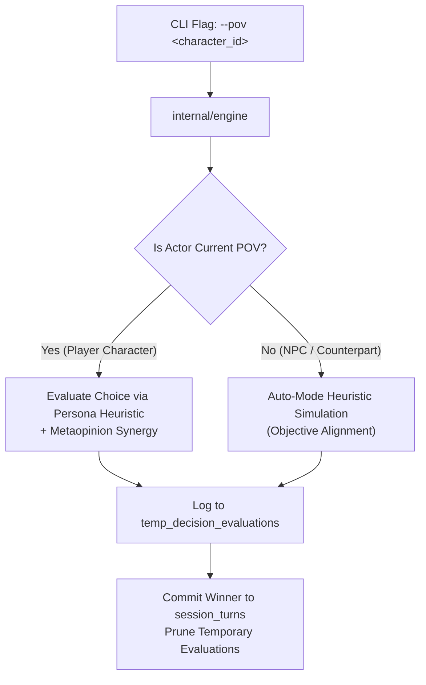
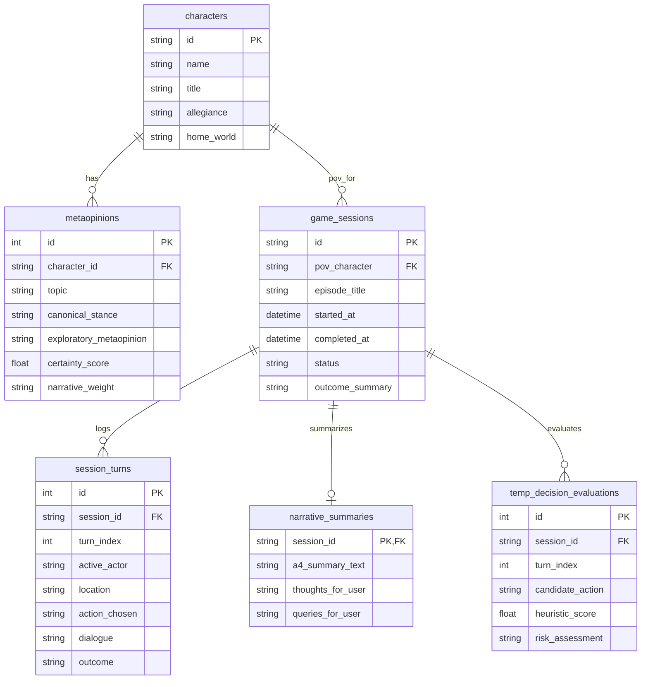

# Prospective: Architectural & Software Design Perspective

This document provides a comprehensive retrospective and prospective analysis of the software design, engineering philosophy, and architectural decisions behind **The Stars, Like Dust** autonomous simulation engine.

---

## 1. Design Philosophy & Guiding Principles

### 1.1 Pure Go & Minimalist Dependency Footprint
The simulation is built in **Go 1.26** conforming strictly to standard library idioms:
- **Zero CGO Dependencies**: Database persistence is implemented using `modernc.org/sqlite`, a pure-Go transpilation of SQLite. This eliminates C compiler dependencies, dynamic library linking errors, and platform incompatibility across Linux environments.
- **Fast Build Times**: The entire application compiles in under two seconds (`go build ./...`), enabling rapid verification cycles and low-latency testing.
- **Strict Modularity**: Subsystems (`internal/engine`, `internal/persona`, `internal/comm`, `internal/storage`, `pkg/dsl`, `pkg/summary`) are completely decoupled with clean interfaces.

### 1.2 Fully Autonomous Play (Eliminating Runaway Loops & Token Exhaustion)
A primary challenge in agentic interactive fiction is runaway turn loops:
- **The Problem**: Human-in-the-loop interactive prompts stall automated orchestrators, while unbounded simulation loops exhaust API token quotas.
- **The Architectural Solution**: 
  - Each simulation run executes a **bounded dramatic episode** (defaulting to 5 curated turns per POV).
  - Every turn evaluates candidate choices autonomously via mathematical goal alignment and psychological heuristics.
  - The simulation halts deterministically at the episode climax, producing a structured deliverable without entering endless background cycles.

---

## 2. Multi-POV Character Agency



### 2.1 The POV Abstraction
Traditional interactive fiction assumes a single static protagonist. *The Stars, Like Dust* engine decouples the narrative vantage:
- Any of the six principal characters can be designated as the primary POV:
  1. `biron_farrill`: The athletic, honorable Widemos heir pursuing vengeance and survival.
  2. `artemisia_hinriad`: The proud Rhodian noblewoman navigating dynastic defiance and space navigation.
  3. `simok_aratap`: The calculating Tyranni imperial commissioner executing counter-insurgency.
  4. `gillbret_hinriad`: The visionary artist seeking psychological and navigational vindication.
  5. `sander_jonti`: The Machiavellian Autarch manipulating rebel cells for personal supremacy.
  6. `hinrik_hinriad`: The subterranean revolutionary orchestrating a 30-year mask of folly.
- When an actor takes a turn:
  - If the actor matches the designated POV, the decision is resolved through that character's cognitive model.
  - If the actor is an opponent or counterpart, the engine runs that character in **auto-mode** using their own goals and vulnerabilities.

---

## 3. The Exploratory Metaopinion Model

### 3.1 Beyond Canon: The Need for Metaopinions
In Asimov's 1951 novel, several characters' underlying motives are only revealed in brief post-climax exposition. To create a dynamic simulation engine, we introduced **Exploratory Metaopinions**:
- Stored as human-readable JSON files in `metadata/*.json`.
- Each metaopinion defines:
  - `Topic`: The core political or philosophical question.
  - `CanonicalStance`: What was explicitly depicted in Asimov's text.
  - `ExploratoryMetaopinion`: The agent's exploratory depth (e.g. why feudal kingdoms fail, why constitutional democracy is more resilient than imperial conquest, the neuro-psychology of the visisonor).
  - `CertaintyScore`: Numerical weighting (0.0 to 1.0).
  - `NarrativeWeight`: Strategic impact (`critical`, `pivotal`, `high`).

### 3.2 Decision Evaluation Algorithm (`internal/persona/evaluator.go`)
Candidate actions $\mathcal{A}$ are scored using a weighted multi-variable heuristic:

$$\text{Score}(A) = \text{Base} + 20 \cdot \mathbb{I}_{\text{Goal}}(A) + \sum_{m \in \text{Meta}} 15 \cdot \text{Certainty}(m) \cdot \mathbb{I}_{m}(A) - 25 \cdot \text{Risk}(A) \cdot (1 - \text{Athletic})$$

This ensures that characters act consistently with their psychological drivers while allowing exploratory metaopinions to sway tactical choices.

---

## 4. Hyper-Comm Protocol (HCP) Subspace DSL

To simulate authentic interstellar communications between planets, starships, and covert cells, we invented the **Hyper-Comm Protocol (HCP)**:
- **Design Goals**: Human-readable, strict serialization, header-based routing, and narrative-event payload tuples.
- **Language Grammar**:
  ```hcp
  DISPATCH <DISPATCH_ID>
  ENCRYPTION: <CIPHER_SUITE>
  ORIGIN: <ORIGIN_NODE>
  TARGET: <TARGET_NODE>
  STARDATE: <STARDATE>
  PRIORITY: <PRIORITY_LEVEL>
  PAYLOAD:
    <TUPLE_TYPE>: "<CONTENT_STRING>"
  AUTHENTICATION: <SIGNATURE_TOKEN>
  END_DISPATCH
  ```
- **AST & Parser (`pkg/dsl`)**: Fully implemented in Go using line-buffered token scanning and AST validation. Achieves **91.1% test coverage**.

---

## 5. Embedded Relational Database & Storage Discipline



### 5.1 Hard Ceiling (< 500 MB) Enforcement
Per the user's directive, database size must never exceed 500 MB:
1. **Scratch Table Pruning**: The `temp_decision_evaluations` table records candidate decision branches during turn evaluation. Once the turn is resolved, ephemeral rows are deleted.
2. **Auto-Compaction (`VACUUM`)**: After episode completion, `storage.PruneAndVacuum()` reclaims unused pages and updates SQLite statistics.
3. **Active Storage Profile**: Active database size is **~60 KB**, orders of magnitude below the 500 MB boundary.

---

## 6. End-of-Run Deliverable Architecture

Every simulation terminates with an automated **1-to-2 page A4 report deliverable**:
- **Section I**: Psychological Profile & Narrative Vantage
- **Section II**: Chronological Scene Trajectory & Turn Breakdown
- **Section III**: Exploratory Metaopinions Manifested
- **Section IV**: Strategic & Interstellar Resolution
- **Section V**: Reflective Thoughts for Arthur Gray
- **Section VI**: Queries & Inquiries for Future Expansion

The summary is simultaneously printed to stdout and persisted into the `narrative_summaries` table for archival retrieval.

---

## 7. Prospective Roadmap (Phase 2 & Beyond)

With Phase 1 complete and verified, prospective capabilities logged in Plane issue **`STARLIKDST-6`** include:
1. **Sub-Agent Interactive Diplomacy**: Spawning concurrent sub-agents to model Aratap and Jonti during multi-ship standoff negotiations.
2. **Alternate Non-Canonical Branching**: Allowing stochastic exploration where Jonti intercepts the Earth Constitution, or where Biron allies with Tyrann against Lingane.
3. **Multi-Episode Campaign Linking**: Chaining completed episodes across multiple characters to construct an overarching campaign chronicle.
